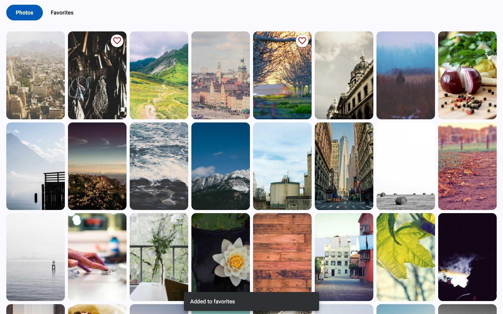
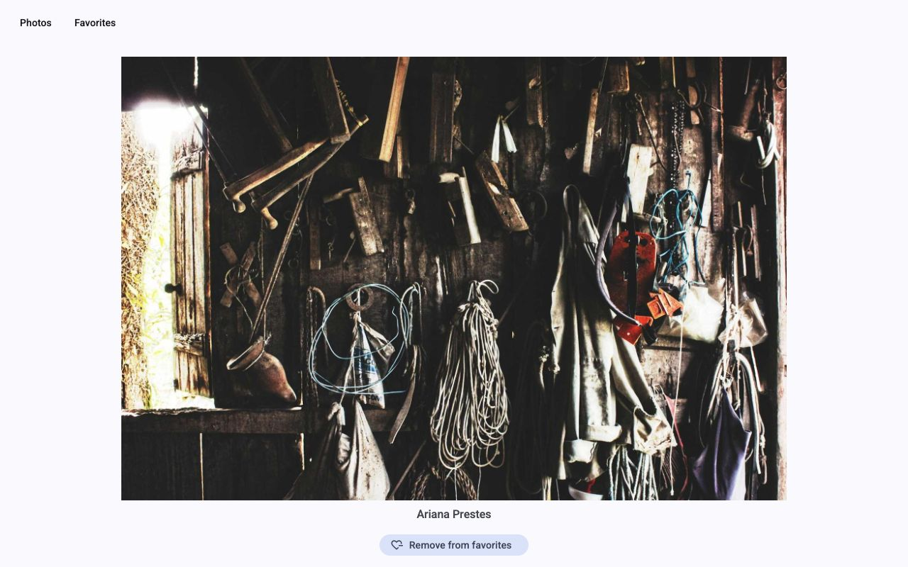

# Photo Library

Test task: a photo library with an infinite photo feed and favorites. Built with Angular 22 and Angular Material.

Demo: https://feprodev.github.io/photo-library/




## Features

- `/` shows the photo feed. New photos load when you scroll down, there is a spinner while loading and a Retry button if the request fails. Click on a photo to add it to favorites. Photos in favorites have a heart icon.
- `/favorites` shows all favorite photos. Click on a photo to open it. Favorites are saved in `localStorage`, so they stay after page reload.
- `/photos/:id` shows one photo on the full screen with the author name and the "Remove from favorites" button. A direct link also works, even if the photo is not in favorites.
- The header is the same on all pages. The active button is highlighted.

## How to run

You need Node.js 24.

```bash
npm install
npm start
```

Then open http://localhost:4200.

| Command                | What it does                           |
| ---------------------- | -------------------------------------- |
| `npm start`            | Dev server                             |
| `npm test`             | Unit tests (Vitest)                    |
| `npm run build`        | Production build in `dist/`            |
| `npm run lint`         | ESLint                                 |
| `npm run format:check` | Prettier check, `npm run format` fixes |

## Stack

Angular 22 (standalone, zoneless, signals), Angular Material 22 (M3), SCSS, Vitest, ESLint, Prettier.

GitHub Actions runs lint, format check, tests and build on every push. Pushes to `main` are deployed to GitHub Pages.

## Project structure

Folders are split by feature, not by file type.

```
src/app/
├── core/          # Photo model, PhotoApi, FavoritesStore, latency interceptor, image loader
├── shared/        # UI blocks with only inputs and outputs: PhotoGrid, PhotoCard, InfiniteScroll
├── layout/        # Header
└── features/      # pages, all lazy loaded
    ├── photos/        # "/" and PhotoFeedStore
    ├── favorites/     # "/favorites"
    └── photo-detail/  # "/photos/:id"
```

Pages can use `shared` and `core`. Components in `shared` don't know about stores, so I use the same `PhotoGrid` on the feed and on favorites.

## Decisions

**Data.** Photos come from [Lorem Picsum](https://picsum.photos). One page of the feed is one request to `/v2/list?page=N&limit=30`. The response already has id, author and size of each photo. The API returns photos sorted by id, so to make the feed random the app starts from a random page (1 to 10) and then goes in order.

**API delay.** The task asks for a random delay of 200-300 ms. I made it with an HTTP interceptor, so `PhotoApi` is just a normal `HttpClient` service and doesn't know about the delay. To remove the delay you only remove the interceptor. The min and max values are in the environment config.

**Infinite scroll.** I wrote a small directive with `IntersectionObserver`. There is an empty element under the grid, and when it gets close to the screen (400px), the directive emits `scrolled`. No scroll listeners and no throttle. While a page is loading, the observer is turned off. After the new photos are rendered it is turned on again. This way the next page loads even if the first page doesn't fill a big screen.

**State.** Simple services with signals, no NgRx because the app is small. `PhotoFeedStore` is a singleton, so the feed is not loaded again when you go to favorites and back. `FavoritesStore` saves to storage through a `STORAGE` token, so in tests I can give it a fake storage. If saved data is broken, the app starts with empty favorites. If saving fails, the app keeps working.

**Images.** `NgOptimizedImage` with my own `IMAGE_LOADER`. In templates I pass only the photo id, and the loader builds the Picsum URL. This gives lazy loading, `srcset` and no layout shift.

**Config.** Values from `environments/*` are provided as DI tokens in `app.config.ts` (`API_URL`, `API_LATENCY_MS`). Services get them with `inject()` and don't import the environment.

**Accessibility.** Photos are real buttons, so they work with keyboard and have a visible focus. Images have alt text with the author name. The active link has `aria-current="page"`, error messages have `role="alert"`.

## Tests

Spec files are next to the code (`*.spec.ts`). There are tests for stores, API, interceptor, image loader, infinite scroll, routes and all pages. HTTP is mocked with `HttpTestingController`. For time I use fake timers, `Math.random` and `IntersectionObserver` are mocked with Vitest. Material components are tested with component harnesses.

## Limitations and what can be improved

- All loaded photos stay in the DOM. With this data it is not a problem: Picsum has about 1000 photos, and the browser handles this number of lazy loaded images well. For a really endless feed it would need virtual scroll.
- Only the start page is random, after it the order is the same as in the API. A really random feed without duplicates should come from the backend, for example a shuffled list with a `seed` parameter. Picsum doesn't have this.
- Picsum has about 1000 photos, so at some point the feed ends and shows "That's all". From any start page there are at least 700 photos.
- No e2e tests and no dark theme.
